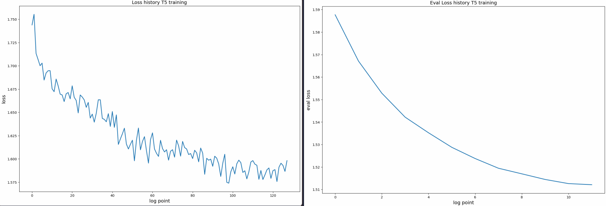
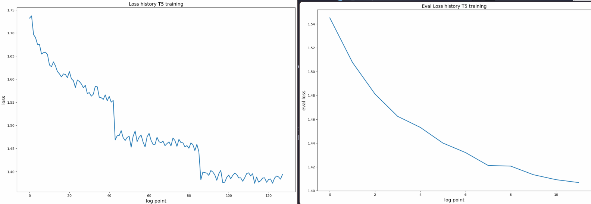

# Final report
In this report I will describe results of the method, test data I chose to measure the models performance, metrics I used to measure the performance, etc.

## Test data
As the test data I chose the dataset of the toxic comments with it's ideal detoxified versions. It's a `s-nlp/paradetox` dataset from the Paper `ParaDetox: Detoxification with Parallel Data` [link](https://aclanthology.org/2022.acl-long.469.pdf). This dataset is manually collected paris of the toxic-nontoxic with the work of the human annotators.

I use the external dataset for the models performance testings, to check the General performance of the T5 model, which I train on the ParaNMT dataset. Format of the samples in the ParaNMT is pretty the same. So, I decided to measure the performance of the model on the external dataset.

## Metrics
As the metrics I used the same as in the paper `Text Detoxification using Large Pre-trained Neural Models` [link](https://arxiv.org/pdf/2109.08914.pdf). The metrics are the following:
* Text toxicity score - measure the toxicity of the text. To calculate it I used the pretrained model, which effectively classifies the text as toxic or non-toxic. `s-nlp/roberta_toxicity_classifier`
* Simmilarity score - measure the semantic simmilarity of the text with the original toxic text. This metric shows, that the initial meaning of the text is not changed after the detoxification. To calculate it I used the pretrained model `sentence-transformers/all-mpnet-base-v2` from the HuggingFace. This model transforms the text into the vector representation. And with transoforming the text into the vector representation we can measure the simmilarity of the texts with the cosine simmilarity metric.
* Fluency score - measure the fluency of the text. This metrics shows how readable the generated text for the human. To calculate it I used the pretrained model `cointegrated/roberta-large-cola-krishna2020` from the HuggingFace. This model was trained on the CoLA dataset, which is the dataset of the sentences, which are grammatically correct. So, this model can be used to measure the fluency of the text.
* Joint metric - measure the overall performance of the model. It's can be calculated as $(1 - toxicity) * similarity * fluency$.  This metric measures the oveall performance of the models. It's the most important metric, as it shows the overall performance of the model. 

### T5 training technical details
T5 initialy was trained with the following hyperparameters:

```python
training_args = TrainingArguments(
    output_dir='../models/T5_checkpoints',   # output directory
    overwrite_output_dir=False,
    num_train_epochs=3,             # total # of training epochs
    per_device_train_batch_size=32,  # batch size per device during training
    gradient_accumulation_steps=4,
    per_device_eval_batch_size=32,    # batch size for evaluation
    warmup_steps=300,               # number of warmup steps for learning rate scheduler
    weight_decay=0,                  # strength of weight decay
    learning_rate=3e-5,
    logging_dir='logs',           # directory for storing logs
    logging_steps=100,
    eval_steps=1000,
    evaluation_strategy='steps',
    save_steps=5000,
    report_to='wandb',
    bf16=True
)
```
And results of the training was the following:

Bit the results of the model was not so good. So, I decided to change the hyperparameters of the model. I changed the learning rate to `3e-4` and the results of the training was the following:

As you can see decreasing of the loss becomes less stable. With start of every new epoch the loss significantly drops. But the results of value of the loss on both Train and Val datasets are better than in the previous case. So, I decided to use this model for the further experiments.

### Performance analysis of the models on the test data:
| Model                  | Toxicity (tox) | Similarity (sim) | Fluency (fluency) | Joint metric (J) |
|------------------------|-----------------|-------------------|-------------------|-------------------|
| Pretrained BART        | 0.077           | 0.851             | 0.726             | 0.5644548913585631|
| Fintuned T5_V1         | 0.280           | 0.830             | 0.788             | 0.46843638177436375|
| Fintuned T5_V2         | 0.280           | 0.817             | 0.796             | 0.481761284144999 |
| Words Masking          | 0.244           | 0.874             | 0.643             | 0.41140514581595666|

---

As you can see from the results above. The best model is the pretrained BART model. But the dataset, used as the test set was used as a train data for the BART model. So, it's obvious, that the results of the toxicity in the test data is the way better comparing with other methods. 

T5 have worse Joint metric then the BART. In terms of text detoxification. this model is worse, In term of the generated text Fluency, it's outperforms all the other methods. And that's why it's the second best method by the Joint metrics(J).

Comparing V1 and V2 of the T5 methods, we can see, that the generated results becomes a little bit worse in terms of the texts simmilarity, but the Fluency of the generated text Increased. So, the Joint metric becomes better with the second version (with $\gamma = 3e^{-4}$) becomes better in general.

Discussing the Words masking method we can see, what in terms of text detoxification this method performs not that bad. But in terms of the Fluency, this method this method is worst. And because of this, Joint metric of this method is the worse.