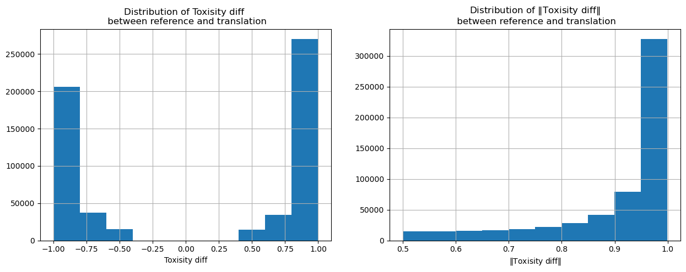
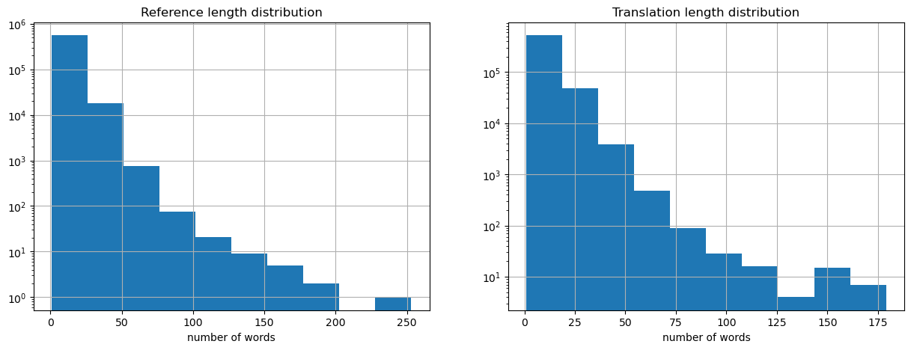
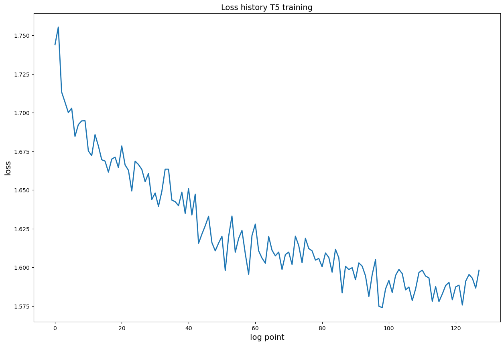
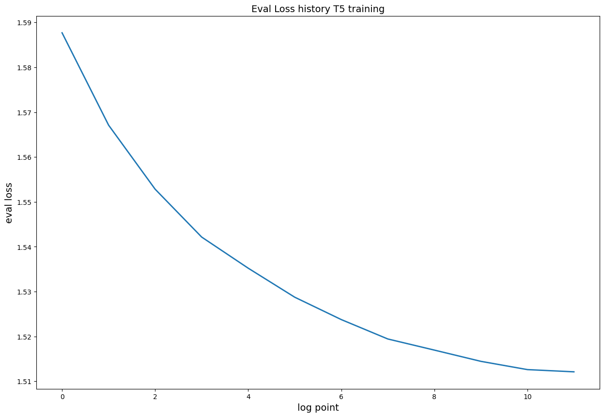
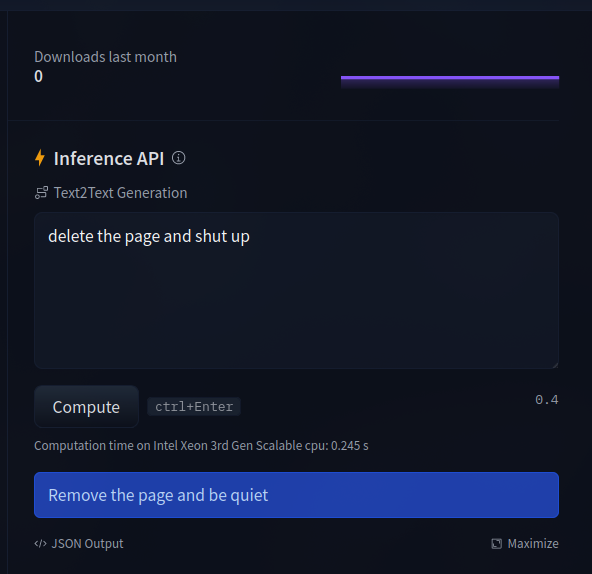
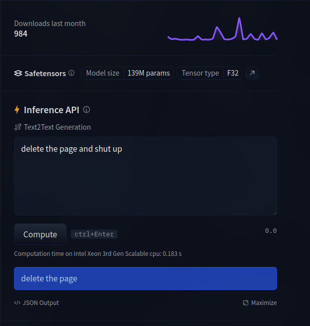

# Solutions Report
In this report I will describe my hypothesis, the steps I took to test it, and the results of my tests.

### Data Analysis
For the given filtered ParaNMT dataset i came up to the following while performing Exploratory Data Analysis:

* Dataste have the following distribution of the toxisity level among the translations and refrerences:



That means that the pairs in the dataset not only in the format of toxic $\rightarrow$ non-toxic, but also non-toxic $\rightarrow$ toxic. That means that we firstly should roformat the initial dataset to the format toxic $\rightarrow$ non-toxic.

* The next step I performed is the analysis of the text length distribution:



This is neccecary to understand the maximum length of the text we can use for the model training. As the context window of the modern language models is not infinite. From the plot, we can see that the maximum length of the text is `~250` tokens. So we can easily use most of the language models for the training.

## Hypothesis
### 1) Detecting the toxic words in the text and just mask them
The first hypothesis is to detect the toxic words in the text and just mask them. For this purpose, I used the pretrained toxocity classifier `s-nlp/roberta_toxicity_classifier` from the HuggingFace. The idea of this method is just to go through the text and mask the words with the probability equal to it's toxicity level. By masking in this method I mean just replacing the word with the `***`. Example of this method results:
```
Input: "I hate you"
Output: "I *** you"
```

### 2) Fine-tuning the language model on the toxic data
The second hypothesis is to fine-tune the language model on the toxic data. For this purpose, I used the T5 model, which was initialy trained on the text paraphrasing task. `ceshine/t5-paraphrase-paws-msrp-opinosis`. And I Fine-Tuned this model on the proposed dataset of toxic $\rightarrow$ non-toxic pairs. Results of the training is the following:
#### Train loss 



#### Validation loss



Results of this method work is the following:



### 3) Use the ready models pretrained on the toxic data
The third hypothesis is to use the ready models pretrained on the toxic data. For this purpose, I used the BART model (`s-nlp/bart-base-detox`) This model was already trained on the toxic data. Results of this method work is the following:

This method is the most effective, as it was trained on the toxic data, and it's results are the best. So, we can use this model as an ideal model and compare the results of the other methods with it.